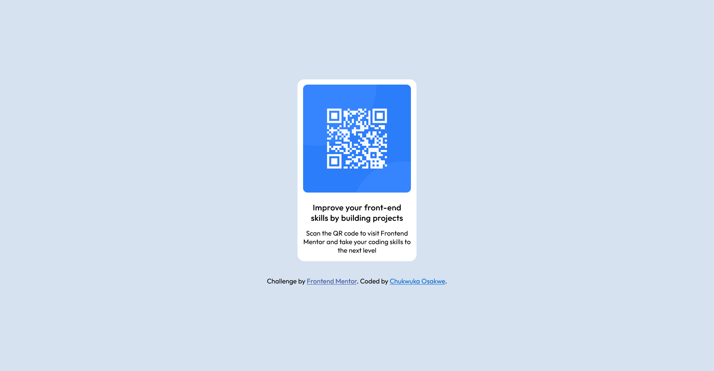
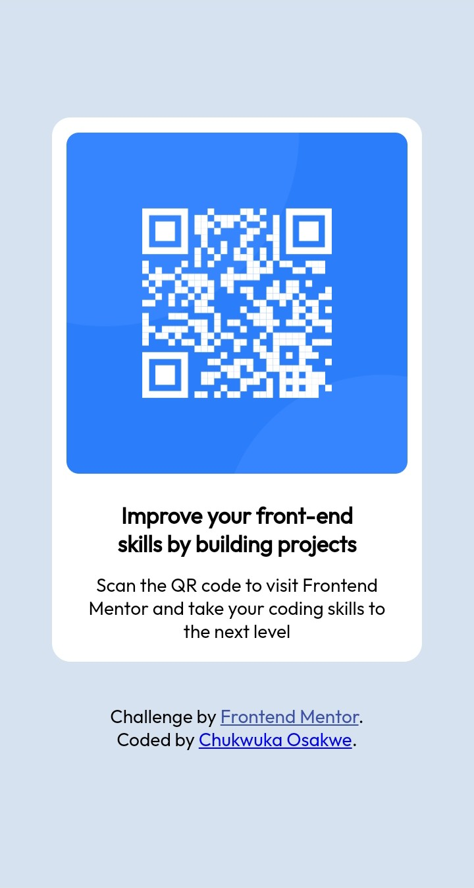

# Frontend Mentor - QR code component solution

This is a solution to the [QR code component challenge on Frontend Mentor](https://www.frontendmentor.io/challenges/qr-code-component-iux_sIO_H). Frontend Mentor challenges help you improve your coding skills by building realistic projects. 

## Table of contents

- [Overview](#overview)
  - [Screenshot](#screenshot)
  - [Links](#links)
- [My process](#my-process)
  - [Built with](#built-with)
  - [What I learned](#what-i-learned)
  - [Continued development](#continued-development)
  - [Useful resources](#useful-resources)

**Note: Delete this note and update the table of contents based on what sections you keep.**

## Overview

### Screenshots

  

### Links

- Live Site URL: [Add live site URL here](https://chukwuka-osakwe.github.io/qr-code-component-1/)

## My process

### Built with

- Semantic HTML5 markup
- CSS custom properties
- Flexbox
- CSS Grid

### What I learned

The most significant learning for me with this project was writing media queries and working with Github. Since I began dabbling in front-end I've never really had any reason to leave VSCode + Live Server while developing since mostly I've been trying to get the basics down.

This project made me learn how to work with Github and Git, create repositories, use the command line to make changes and version control the code (it was a disaster at first, I spent a whole day wrangling with a repository I nuked because I was trying to move code from a "master" branch to a "main" branch). I also use Github Pages to host the static site for this project, and given that I've been meaning to look into Github Pages for a while now, that was a welcome development.

Writing media queries to adjust the design for mobile was also a first step into something I'd inevitably have to learn: mobile, responsive design. The world is increasingly mobile-oriented and it makes no sense not to be the same in 2023.

### Continued development

I want to keep working on writing media queries and just generally designing for different screen sizes and device types (while being intensely mobile-oriented of course).

### Useful resources

- [Intro To Media Queries](https://www.example.com) - This 7 minute intro to writing media queries helped me out as a beginner to the concept.
